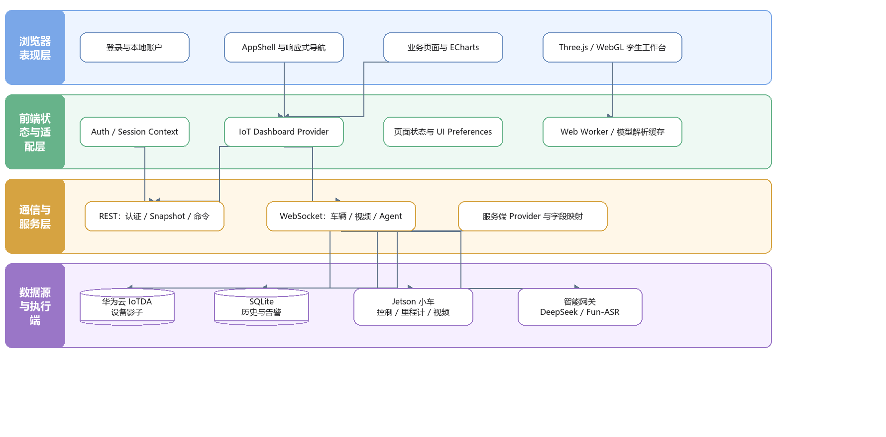

# 危化智巡（XingXun IoT Control Center）

面向危险环境研究与教学演示的多端 IoT 控制中心。项目将环境遥测、告警与工单、空间数字孪生、AI 辅助研判、Jetson 巡检车和 STM32 传感器节点整合到一套可扩展的 Web/Android 体验中。

仓库默认使用 Mock 数据和合成点云，不需要 DeepSeek、阿里云或华为云凭据即可启动。真实云服务、语音识别和车辆控制均为显式启用的可选能力。

> [!CAUTION]
> 本项目是研究与演示原型，不是经过功能安全、网络安全或防爆认证的工业控制系统。不得把它作为危险化学品现场的唯一监测、告警、消防或车辆控制手段。连接真实设备前，应在隔离环境中完成风险评估，并配备人工监护、物理急停和独立安全联锁。

## 功能概览

- 环境监测：温度、湿度、CO₂、TVOC、甲醛和光照的实时状态、趋势与历史记录。
- 告警管理：告警规则、事件时间线、处置状态与工单视图。
- 空间孪生：PLY 点云浏览、几何诊断层、传感器映射和空间分布可视化。
- AI Agent：基于证据的页面操作与辅助分析；默认 Mock，可选接入 DeepSeek 和 Fun-ASR。
- 巡检车：Jetson WebSocket 遥测、摄像头画面、手动控制、导航任务与安全停车流程。
- 多端运行：响应式 Web、Android WebView/原生桥、Jetson 服务和 STM32 固件。
- 离线建模：从相机或视频整理数据，经 COLMAP、Brush 或 OpenMVS 生成空间资产。

## 架构与技术栈



运行时数据流大致如下：

```text
STM32 / 传感器 ──> IoTDA 或 Mock Provider ──> Web API ──> 控制中心
                                                     ├──> 告警 / 历史 / 空间视图
DeepSeek / Fun-ASR <──> Agent Gateway <──────────────┤
Jetson 巡检车      <──> WebSocket <──────────────────┘

Scanner ──> PLY / GLB ──> Web 数字孪生与 Android 离线资源
```

| 层级 | 主要技术 |
| --- | --- |
| Web | TypeScript、React 19、Next.js 16、vinext、Vite 8、Tailwind CSS |
| 可视化 | Three.js、ECharts、Web Worker |
| Agent 与网关 | Node.js、tsx、WebSocket、DeepSeek API、Fun-ASR |
| 数据 | Drizzle ORM、SQLite 兼容存储、Cloudflare D1 可选示例 |
| Android | Java、Gradle、Android WebView、原生桥 |
| 扫描与重建 | Python、OpenCV、NumPy、SciPy、COLMAP、Brush、OpenMVS |
| 车端 | Python、Jetson、WebSocket、串口、I²C、Ultralytics |
| 固件 | STM32F103、Keil MDK、ESP8266 AT、MQTT |

可编辑的架构、数据流和页面地图源文件位于 [`docs/architecture`](docs/architecture/)。

## 快速启动：安全 Mock 模式

### 1. 准备环境

- Node.js `>= 22.13.0`
- npm（随 Node.js 安装）
- Git

克隆并安装锁定依赖：

```bash
git clone https://github.com/milk600/xingxun-iot-control-center.git
cd xingxun-iot-control-center
npm ci
```

复制安全配置模板：

```bash
cp .env.example .env.local
```

Windows PowerShell 使用：

```powershell
Copy-Item .env.example .env.local
```

`.env.example` 已启用 Mock 数据与 Mock Agent，并关闭车辆控制、全权限和自动配对。首次体验无需填写任何云密钥。

### 2. 初始化本地演示账号

初始化脚本只保存密码派生值，不保存密码原文。PowerShell 推荐使用凭据对话框，避免密码进入命令历史：

```powershell
$credential = Get-Credential -UserName admin -Message "创建本地演示账号"
$env:XINGXUN_SETUP_USERNAME = $credential.UserName
$env:XINGXUN_SETUP_PASSWORD = $credential.GetNetworkCredential().Password
npm run auth:setup
Remove-Item Env:XINGXUN_SETUP_USERNAME -ErrorAction SilentlyContinue
Remove-Item Env:XINGXUN_SETUP_PASSWORD -ErrorAction SilentlyContinue
Remove-Variable credential -ErrorAction SilentlyContinue
```

macOS/Linux 可在不回显密码的终端输入：

```bash
read -r -s -p "Password: " XINGXUN_SETUP_PASSWORD
echo
export XINGXUN_SETUP_PASSWORD
npm run auth:setup
unset XINGXUN_SETUP_PASSWORD
```

脚本会生成被 Git 忽略的 `data/local-auth.json`、`android/auth.properties`，并把本地登录派生配置写入 `.env.local`。

### 3. 启动

仅启动 Web：

```bash
npm run dev
```

浏览器访问 `http://localhost:3000`，使用刚创建的本地账号登录。

同时启动 Web 与 Agent 网关：

```bash
npm run agent:dev
```

`agent:dev` 会让 Web 服务监听局域网地址；仅应在受信任网络中使用。单独启动 Agent 网关可运行 `npm run agent:start`。

生产构建：

```bash
npm run build
npm run start
```

## 配置

所有本地配置都应放在被忽略的 `.env.local` 或操作系统的安全环境变量中。下面只列出变量名；模板及代码库不包含任何真实凭据。

| 范围 | 环境变量 |
| --- | --- |
| 数据提供器 | `IOT_PROVIDER`、`IOT_SENSOR_PROVIDER` |
| 华为云 IoTDA | `HUAWEI_IOTDA_ENDPOINT`、`HUAWEI_IOTDA_PROJECT_ID`、`HUAWEI_IOTDA_PROJECT_NAME`、`HUAWEI_IOTDA_REGION_ID`、`HUAWEI_IOTDA_DEVICE_ID`、`HUAWEI_IOTDA_SERVICE_ID`、`HUAWEI_IOTDA_INSTANCE_ID`、`HUAWEI_IOTDA_STALE_AFTER_MS`、`HUAWEI_IOTDA_OFFLINE_AFTER_MS` |
| 华为云认证 | `HUAWEI_CREDENTIALS_FILE`、`HUAWEICLOUD_SDK_AK`、`HUAWEICLOUD_SDK_SK`、`HUAWEI_IOTDA_TOKEN`、`HUAWEI_IAM_ENDPOINT`、`HUAWEI_IAM_ACCOUNT_NAME`、`HUAWEI_IAM_USERNAME`、`HUAWEI_IAM_PASSWORD` |
| 旧版可信网关 | `HUAWEI_IOT_GATEWAY_URL`、`HUAWEI_IOT_GATEWAY_TOKEN` |
| DeepSeek | `DEEPSEEK_API_KEY`、`DEEPSEEK_BASE_URL`、`DEEPSEEK_MODEL`、`DEEPSEEK_REASONING_MODE`、`DEEPSEEK_ANALYSIS_MODEL`、`DEEPSEEK_ANALYSIS_REASONING_EFFORT` |
| 阿里云百炼 / Fun-ASR | `DASHSCOPE_CREDENTIALS_FILE`、`DASHSCOPE_API_KEY`、`DASHSCOPE_WORKSPACE_ID`、`FUN_ASR_MODEL`、`FUN_ASR_WS_URL` |
| Agent 网关 | `AI_GATEWAY_PORT`、`AI_ALLOW_LOCAL_AUTO_PAIR`、`AI_MOCK_MODE`、`AI_VEHICLE_ENABLED`、`AI_FULL_ACCESS`、`IOT_WEB_BASE_URL` |
| Jetson | `JETSON_WS_URL` |
| 遥测历史 | `TELEMETRY_HISTORY_DB`、`TELEMETRY_RETENTION_DAYS`、`TELEMETRY_POLL_INTERVAL_MS`、`TELEMETRY_REQUEST_TIMEOUT_MS`、`TELEMETRY_SAMPLE_INTERVAL_MS` |
| 账号初始化 | `XINGXUN_SETUP_USERNAME`、`XINGXUN_SETUP_DISPLAY_NAME`、`XINGXUN_SETUP_PASSWORD` |

`npm run auth:setup` 还会生成 `LOCAL_AUTH_*` 本地登录派生配置。通常不需要手工编辑这些字段。

接入真实服务时请遵守以下边界：

1. 长期云密钥必须保留在受信任的服务端或密钥管理服务中，客户端只访问受控网关。
2. 使用最小权限、独立测试账号和可轮换的短期凭据。
3. 不要把密钥、凭据 CSV、设备密码、真实终端地址或包含它们的日志提交到 Git。
4. 从不受信任的客户端直连云 API 只适合隔离环境中的短期调试，不是生产架构。

## 子系统入口

| 子系统 | 入口 | 说明 |
| --- | --- | --- |
| Web 控制中心 | `npm run dev` | 页面、API、Mock/IoT Provider、告警、历史与数字孪生 |
| Agent 网关 | `npm run agent:start` | AI 规划、语音转写、遥测协调与可选车辆动作 |
| Android | `npm run android:debug` | 构建离线 Web 资源，执行 Android lint 并生成 Debug APK |
| Scanner | `python scanner/room_scan.py doctor` | 检查扫描、稀疏重建、3DGS 与 CPU 网格工具链 |
| Jetson | `python3 jetson/vehicle_server.py` | 车端遥测、视频、导航、PID 与火焰检测服务 |
| STM32 | `firmware/stm32-huawei-iotda/project.uvprojx` | Keil 工程、传感器采集、ESP8266 与 IoTDA 上报 |

### Web 与 Agent

- 页面入口位于 `app/`，服务端 Provider 位于 `app/lib/iot/providers/`。
- Agent 动作、规划、权限与协议位于 `agent/`。
- `npm run iotctl` 提供本地命令行入口。
- 华为云辅助脚本包括 `iot:huawei:setup`、`iot:huawei:inspect` 和 `iot:huawei:verify`；运行前应先配置受限测试账号。

### Android

Android 说明见 [`android/README.md`](android/README.md)。

```powershell
npm run android:debug
npm run android:release
```

安全边界：

- Release 构建会把本地登录、华为云、DeepSeek 和 DashScope 凭据字段强制置空，不在 APK 中内嵌这些凭据。
- Debug 构建可以读取 `.env.local` 与 `android/auth.properties` 以便本机联调，因此 Debug APK 不得分发、上传或交付。
- Release 构建仍需由部署方自行签名、审计并配置可信服务端网关；“不内嵌凭据”不等于已经达到生产安全要求。
- 云密钥不应放在 Android 应用中。生产移动端应调用能够执行鉴权、限流、审计和密钥轮换的服务端。

所有 APK、AAB、Gradle 构建目录和生成的 Web Assets 均被 `.gitignore` 排除。

### Scanner

详细命令与数据规则见 [`scanner/README.md`](scanner/README.md) 和 [`scanner/DATASETS.md`](scanner/DATASETS.md)。

```powershell
py -3 -m venv .venv
.\.venv\Scripts\python.exe -m pip install --upgrade pip
.\.venv\Scripts\python.exe -m pip install -r scanner\requirements.txt
.\.venv\Scripts\python.exe scanner\room_scan.py doctor
```

COLMAP、Brush 和 OpenMVS 是可选的外部工具，不随仓库分发。原始照片、视频、数据库和重建结果应保存在 `scanner/datasets/` 或外部数据盘中，不应提交到 Git。

### Jetson

部署前阅读 [`jetson/DEPLOYMENT.md`](jetson/DEPLOYMENT.md) 与 [`jetson/PID_CONTROL_PROTOCOL.md`](jetson/PID_CONTROL_PROTOCOL.md)。

```bash
python3 -m pip install -r jetson/requirements.txt
python3 jetson/vehicle_server.py
```

Jetson 上的 PyTorch、OpenCV、相机 SDK 和设备驱动通常与 JetPack/硬件平台绑定。不要用通用 wheel 盲目覆盖已有平台包；模型权重、设备路径和标定数据也应在目标设备上单独管理。

首次实车测试必须抬起驱动轮或选择净空区域，限制速度和距离，并全程准备物理急停。未经验证不得启用 Agent 车辆权限。

### STM32 固件

固件说明见 [`firmware/stm32-huawei-iotda/README.md`](firmware/stm32-huawei-iotda/README.md)。

```powershell
cd firmware\stm32-huawei-iotda
Copy-Item User\app_config.example.h User\app_config.h
```

只在本机填写 Wi-Fi 与 IoTDA 设备参数。`User/app_config.h`、Keil 用户文件和编译产物均已忽略。当前示例固件使用 MQTT/TCP 1883，不提供 TLS，只适合隔离网络中的研究演示。

## 合成演示数据

公开仓库不包含真实房间照片、视频、扫描数据、地图或设备轨迹。数字孪生默认加载确定性生成的合成房间：

```text
public/models/room-01/
  demo-room.ply
  demo-room-framework.ply
  demo-room-gap.ply
  room-top-map.svg
  room-top-mask.svg
  room-navigation-overhead-map.svg
```

重新生成点云：

```bash
node scripts/generate-demo-room.mjs
```

真实 PLY/GLB 往往体积较大，也可能泄露建筑布局和人员活动信息。仓库的 `.gitignore` 默认排除额外 PLY、扫描数据集和私有平面图；请在本地完成脱敏、授权和体积评估后再决定是否公开。

## 目录结构

```text
.
├─ app/                         # Web 页面、API、组件和领域逻辑
├─ agent/                       # Agent 网关、动作协议、权限和测试
├─ android/                     # Android WebView 与原生桥工程
├─ scanner/                     # 扫描、COLMAP、Brush、OpenMVS 工具
├─ jetson/                      # 巡检车服务、导航、PID 与测试
├─ firmware/stm32-huawei-iotda/ # STM32 + ESP8266 固件
├─ public/                      # 品牌资源与合成演示空间资产
├─ db/                          # Drizzle 数据结构
├─ drizzle/                     # 数据库迁移
├─ worker/                      # Cloudflare Worker 入口
├─ scripts/                     # 初始化、构建、验证和数据生成脚本
├─ tests/                       # Web 构建与渲染契约测试
├─ docs/architecture/           # 架构图、数据流与页面地图
└─ examples/                    # 可选集成示例
```

## 测试与质量检查

Node.js：

```bash
npm run lint
npm run test:agent
npm test
```

`npm test` 会先执行生产构建，再运行渲染结果与资源契约测试。

Scanner：

```bash
python -B -m unittest discover -s scanner/tests -v
```

Jetson：

```bash
python -B -m unittest discover -s jetson -p "test_*.py" -v
```

Android：

```powershell
npm run android:debug
```

提交前还应检查暂存文件与体积：

```bash
git status --short
git diff --cached --stat
```

建议在 CI 和本地增加密钥扫描。`.gitignore` 只能降低误提交概率，不能撤销已经进入 Git 历史的凭据；一旦泄露，应立即轮换并清理历史。

## 隐私与安全

以下内容被有意排除在公开仓库之外：

- `.env.local`、云 API 密钥、凭据 CSV、设备密码和本地认证材料；
- SQLite 数据库、真实遥测、日志和运行时状态；
- Android APK/AAB、Debug 凭据和生成资产；
- 扫描照片、视频、真实点云、建筑平面图与人员活动数据；
- Jetson 模型权重、厂商 SDK、设备标定与本地网络配置；
- STM32 的 `app_config.h`、Keil 用户配置和固件构建产物；
- 内部交付文档、临时文件和个人开发工具状态。

如果你曾在旧代码、APK、固件、日志或聊天记录中放入真实密钥，仅从当前仓库删除文件是不够的：请轮换 DeepSeek、DashScope、华为云、Wi-Fi 和设备凭据，并确认旧制品不再可访问。

发现安全问题时，请不要在公开 Issue 中提交密钥、真实设备地址、建筑数据或可复现的危险控制步骤。按 [`SECURITY.md`](SECURITY.md) 的方式进行负责任披露。

## 使用限制与免责声明

- Mock 遥测和合成场景只能用于界面与流程验证，不能作为真实安全判断的证据。
- AI 输出可能错误、过时或不完整；涉及告警处置、路径规划和车辆动作时必须由具备资质的人员复核。
- 网络断开、传感器故障、时间漂移或上报延迟都可能导致显示状态与现场不一致。
- 任何实车、执行器或高功率设备都必须有独立于本软件的硬件急停与故障安全机制。
- 使用者需自行满足所在地的隐私、网络安全、无线电、云服务、劳动安全和危险品管理要求。

## 贡献

欢迎提交问题、文档改进和经过测试的 Pull Request。开始前请阅读 [`CONTRIBUTING.md`](CONTRIBUTING.md)，并确保：

1. 不提交任何真实密钥、个人信息或未获授权的数据；
2. 新功能在 Mock 模式下可测试；
3. 涉及车辆、固件或云权限的变更包含明确的安全边界；
4. 相关 lint、单元测试和构建检查通过。

## 许可证

本项目许可证见 [`LICENSE`](LICENSE)。
